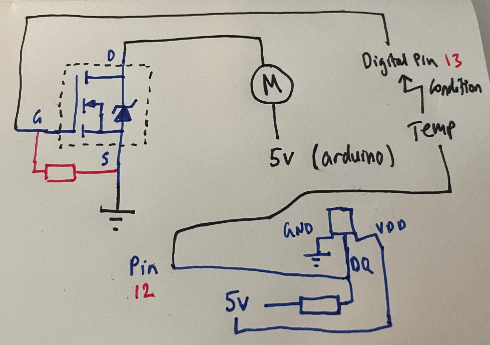
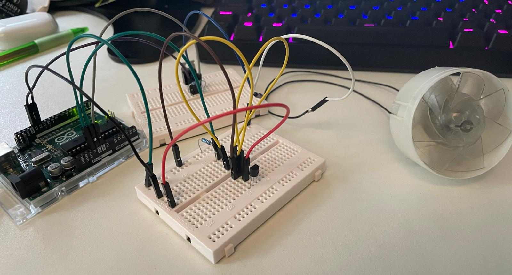

[__Back to Projects__](projects.md)

# 🔥 Temperature Controlled Fan

This is a project I made to turn on/off a fan based on the temperature 🌡️.

## What I already had:
- 🧵 Wire Jumpers
- 🛠️ Resistors
- 🌡️ Temperature Sensor (DS18B20)
- 💨 Fan (salvaged from an old hair dryer)
- 🤖 Arduino Uno
- 🍞 Breadboard

## What I had to get:
- 💥 A mosfet (I used an IRFZ44N)

## How it works:

The Arduino reads the temperature from the sensor and if it's above 30 degrees, it turns on the mosfet which in turn powers up the fan 🌀. If the temperature is below 30 degrees, the mosfet is turned off and the fan stops spinning ❌.

## Code:

```
#include <OneWire.h>
#include <DallasTemperature.h>

#define ONE_WIRE_BUS 12

OneWire oneWire(ONE_WIRE_BUS);
DallasTemperature sensors(&oneWire);

void setup() {
  
  pinMode(13, OUTPUT); # Pin 13 is the mosfet gate
  Serial.begin(9600);
  sensors.begin();
}

void loop() {

  sensors.requestTemperatures(); // Send the command to get temperatures
  Serial.print("Celsius temperature: ");
  Serial.print(sensors.getTempCByIndex(0)); 
  Serial.print("\n");

  if( sensors.getTempCByIndex(0) > 30){
    digitalWrite(13, HIGH); // Turn on the mosfet
  } else{ 
    digitalWrite(13, LOW); // Turn off the mosfet
  }

  delay(5000); // Wait for 5 seconds

}

```



## Demo:

<iframe width="560" height="315" src="https://www.youtube.com/embed/KIM-IGIcUgY" title="YouTube video player" frameborder="0" allow="accelerometer; autoplay; clipboard-write; encrypted-media; gyroscope; picture-in-picture; web-share" allowfullscreen></iframe>

## Time taken:

Other than waiting for the mosfet to arrive, it took me about an hour and a half to make this (salvaging and cleaning the motor from the hairdryer took the longest!) 😅.

## Rating:

👍 Enjoyment: It was pretty fun to make this. I had to do a bit of research to figure out how to use the mosfet and how to use the temperature sensor.

💪 Difficulty: 1/5

## Future improvements:

I could add a potentiometer to control the speed of the fan.
I could make a case for the circuit and the fan (shall I buy a 3D printer? 🤔)

## Resources used
- [Temperature sensor guide](https://randomnerdtutorials.com/guide-for-ds18b20-temperature-sensor-with-arduino/)
- [Mosfet](https://images.theengineeringprojects.com/image/webp/2017/09/Introduction-to-IRFZ44N_3.png.webp?ssl=1)
